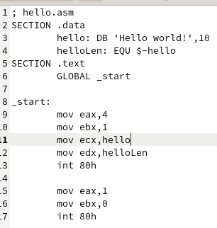

---
## Front matter
title: "Отчёта по лабораторной работе"
subtitle: "NASM"
author: "Лев Евгеньевич Гельбарт"

## Bibliography
bibliography: bib/cite.bib
csl: pandoc/csl/gost-r-7-0-5-2008-numeric.csl

## Pdf output format
fontsize: 12pt
linestretch: 1.5
papersize: a4
documentclass: scrreprt
## I18n polyglossia
polyglossia-lang:
  name: russian
  options:
	- spelling=modern
	- babelshorthands=true
polyglossia-otherlangs:
  name: english
## I18n babel
babel-lang: russian
babel-otherlangs: english
## Fonts
mainfont: PT Serif
romanfont: PT Serif
sansfont: PT Sans
monofont: PT Mono
mainfontoptions: Ligatures=TeX
romanfontoptions: Ligatures=TeX
sansfontoptions: Ligatures=TeX,Scale=MatchLowercase
monofontoptions: Scale=MatchLowercase,Scale=0.9
## Biblatex
biblatex: true
biblio-style: "gost-numeric"
biblatexoptions:
  - parentracker=true
  - backend=biber
  - hyperref=auto
  - language=auto
  - autolang=other*
  - citestyle=gost-numeric
## Pandoc-crossref LaTeX customization
figureTitle: "Рис."
tableTitle: "Таблица"
listingTitle: "Листинг"
lofTitle: "Список иллюстраций"
lotTitle: "Список таблиц"
lolTitle: "Листинги"
## Misc options
indent: true
header-includes:
  - \usepackage{indentfirst}
  - \usepackage{float} # keep figures where there are in the text
  - \floatplacement{figure}{H} # keep figures where there are in the text
---

# Цель работы

Цель работы - освоение процедуры компиляции и сборки программ, написанных на ассемблере NASM.

# Выполнение лабораторной работы

{ #fig:001 width=70% }

Создадим каталог для программ, текстовый файл, преобразуем текст в программный код, скомпилируем текстовый файл, скомпануем объектный файл, затем запустим программу и получим Hello world! (рис. [-@fig:001]).

{ #fig:002 width=70% }

Здесь приведен сам текст кода (рис. [-@fig:002]).

{ #fig:003 width=70% }

{ #fig:004 width=70% }

Здесь приведен процесс создания аналогичной программы, но выдающей Lev Gelbart! (рис. [-@fig:003]), (рис. [-@fig:004]).

{ #fig:005 width=70% }

А здесь сам код (рис. [-@fig:005]).

{ #fig:006 width=70% }

{ #fig:007 width=70% }

На данных фото процесс копирования файлов в репозиторий и загрузка на github (рис. [-@fig:006]), (рис. [-@fig:007]).

# Выводы

Были освоены навыки работы с ассемблером NASM.

