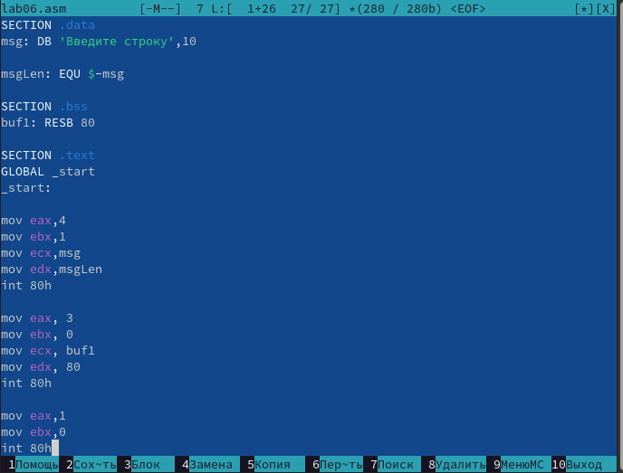
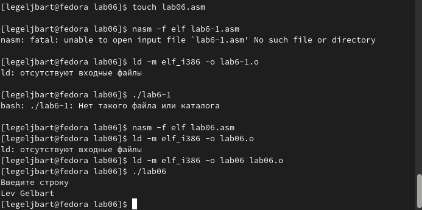
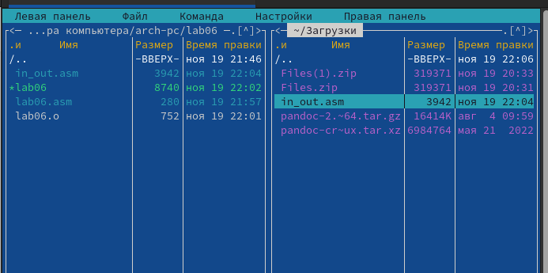
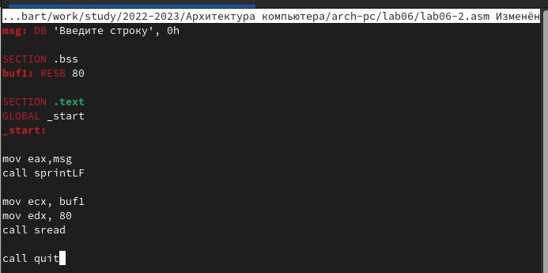
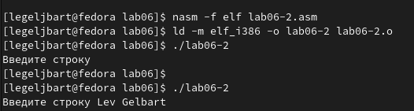
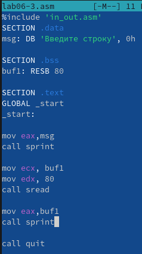
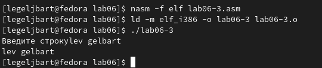

---
## Front matter
title: "Отчёт по лабораторной работе 6"
subtitle: "Работа с MC, структура программы в NASM"
author: "Лев Евгеньевич Гельбарт"

## Bibliography
bibliography: bib/cite.bib
csl: pandoc/csl/gost-r-7-0-5-2008-numeric.csl

## Pdf output format
fontsize: 12pt
linestretch: 1.5
papersize: a4
documentclass: scrreprt
## I18n polyglossia
polyglossia-lang:
  name: russian
  options:
	- spelling=modern
	- babelshorthands=true
polyglossia-otherlangs:
  name: english
## I18n babel
babel-lang: russian
babel-otherlangs: english
## Fonts
mainfont: PT Serif
romanfont: PT Serif
sansfont: PT Sans
monofont: PT Mono
mainfontoptions: Ligatures=TeX
romanfontoptions: Ligatures=TeX
sansfontoptions: Ligatures=TeX,Scale=MatchLowercase
monofontoptions: Scale=MatchLowercase,Scale=0.9
## Biblatex
biblatex: true
biblio-style: "gost-numeric"
biblatexoptions:
  - parentracker=true
  - backend=biber
  - hyperref=auto
  - language=auto
  - autolang=other*
  - citestyle=gost-numeric
## Pandoc-crossref LaTeX customization
figureTitle: "Рис."
tableTitle: "Таблица"
listingTitle: "Листинг"
lofTitle: "Список иллюстраций"
lotTitle: "Список таблиц"
lolTitle: "Листинги"
## Misc options
indent: true
header-includes:
  - \usepackage{indentfirst}
  - \usepackage{float} # keep figures where there are in the text
  - \floatplacement{figure}{H} # keep figures where there are in the text
---

# Цель работы

Цель работы - приобрести практические навыки работы в MC и освоение языка ассемблера mov и int.

# Выполнение лабораторной работы
{ #fig:001 width=70% }

Создадим папку lab06 в arch-pc, в ней файл lab06, напишем в нем код (рис. [-@fig:001]).

{ #fig:002 width=70% }

Превратим текст в функционирующий код и запустим программу (рис. [-@fig:002]).

{ #fig:003 width=70% }

Скопируем in_out.asm в нашу папку (рис. [-@fig:003]).

{ #fig:004 width=70% }

Напишем код с использованием in_out.asm (рис. [-@fig:004]).

{ #fig:005 width=70% }

Снова превратим текст в работающий код и запустим программу. Заметим, что в данном случае не происходит сдвига каретки после строки с просьбой о вводе данных (рис. [-@fig:005]).

{ #fig:006 width=70% }

# Выполнение самостоятельной работы

Напишем новый код, в котором выведется введенная строка (рис. [-@fig:006]).

{ #fig:007 width=70% }

Преобразуем код в программу, запустим ее и насладимся результатом (рис. [-@fig:007]).

# Выводы

Были приобретены навыки работы в MC и языка NASM.

