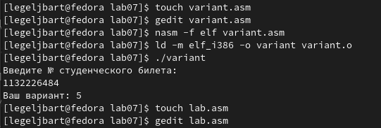

---
## Front matter
title: "Отчёт по лабораторной работе"
subtitle: "Арифметические операции в NASM"
author: "Лев Евгеньевич Гельбарт"

## Generic otions
lang: ru-RU
toc-title: "Содержание"

## Pdf output format
fontsize: 12pt
linestretch: 1.5
papersize: a4
documentclass: scrreprt
## I18n polyglossia
polyglossia-lang:
  name: russian
  options:
	- spelling=modern
	- babelshorthands=true
polyglossia-otherlangs:
  name: english
## I18n babel
babel-lang: russian
babel-otherlangs: english
## Fonts
mainfont: PT Serif
romanfont: PT Serif
sansfont: PT Sans
monofont: PT Mono
mainfontoptions: Ligatures=TeX
romanfontoptions: Ligatures=TeX
sansfontoptions: Ligatures=TeX,Scale=MatchLowercase
monofontoptions: Scale=MatchLowercase,Scale=0.9
## Biblatex
biblatex: true
biblio-style: "gost-numeric"
biblatexoptions:
  - parentracker=true
  - backend=biber
  - hyperref=auto
  - language=auto
  - autolang=other*
  - citestyle=gost-numeric
## Pandoc-crossref LaTeX customization
figureTitle: "Рис."
tableTitle: "Таблица"
listingTitle: "Листинг"
lofTitle: "Список иллюстраций"
lotTitle: "Список таблиц"
lolTitle: "Листинги"
## Misc options
indent: true
header-includes:
  - \usepackage{indentfirst}
  - \usepackage{float} # keep figures where there are in the text
  - \floatplacement{figure}{H} # keep figures where there are in the text
---

# Цель работы

Освоение арифметическх инструкций языка ассемблера NASM.

# Выполнение лабораторной работы

{ #fig:001 width=70% }

По шаблону создаются программы, выдающие j и нечитаемый символ (рис. [-@fig:001])

{ #fig:002 width=70% }

По шаблону создаются программы, выдающие 106, 10, 4 и 1, 5 и 1 (рис. [-@fig:002])

{ #fig:003 width=70% }

Создана и проверена программа, создающая вариант на основе номера студбилета (рис. [-@fig:003])

Приступим к ответам на вопросы.
1 - строки mov eax,msg call sprintLF
2 - mov ecx,x - присваивает ячейке ecx значение х. mov edx, 80 - копируем из памяти по адресу 80 данные в ячейку edx. call sread - считывем из ввода данные. 
3 - преобразует данные в число
4 - xor edx,edx mov ebx,20 div ebx inc edx 
5 - результат в eax, остаток в edx
6 - значение увеличивается на 1
7 - mov eax,rem call sprint mov eax,edx call iprintLF

{ #fig:004 width=70% }

Написана программа, выполняющая фомулу (9х-8)/8 как (9/8)х+1 (почленное деление) на двух иксах, результаты проверены, они достоверны.

# Выводы
Были освоены арифметические инструкции языка ассемблера NASM.

