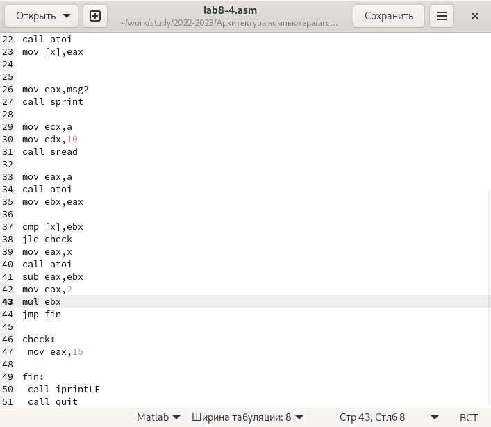

---
## Front matter
title: "Отчёт по лабораторной работе 8"
subtitle: "Безусловный и условный переход в NASM"
author: "Лев Евгеньевич Гельбарт"

## Pdf output format
fontsize: 12pt
linestretch: 1.5
papersize: a4
documentclass: scrreprt
## I18n polyglossia
polyglossia-lang:
  name: russian
  options:
	- spelling=modern
	- babelshorthands=true
polyglossia-otherlangs:
  name: english
## I18n babel
babel-lang: russian
babel-otherlangs: english
## Fonts
mainfont: PT Serif
romanfont: PT Serif
sansfont: PT Sans
monofont: PT Mono
mainfontoptions: Ligatures=TeX
romanfontoptions: Ligatures=TeX
sansfontoptions: Ligatures=TeX,Scale=MatchLowercase
monofontoptions: Scale=MatchLowercase,Scale=0.9
## Biblatex
biblatex: true
biblio-style: "gost-numeric"
biblatexoptions:
  - parentracker=true
  - backend=biber
  - hyperref=auto
  - language=auto
  - autolang=other*
  - citestyle=gost-numeric
## Pandoc-crossref LaTeX customization
figureTitle: "Рис."
tableTitle: "Таблица"
listingTitle: "Листинг"
lofTitle: "Список иллюстраций"
lotTitle: "Список таблиц"
lolTitle: "Листинги"
## Misc options
indent: true
header-includes:
  - \usepackage{indentfirst}
  - \usepackage{float} # keep figures where there are in the text
  - \floatplacement{figure}{H} # keep figures where there are in the text
---

# Цель работы

Изучение команд условного и безусловного переходов. Приобретение навыков написания программ с использованием переходов. Знакомство с назначением и структурой файла листинга.

# Выполнение лабораторной работы
{ #fig:001 width=70% }
По образцу пишем программы, выдающие сообщения 2 и 3, 2 и 1, а затем 3, 2 и 1 (рис. [001]).
{ #fig:002 width=70% }
По следующему шаблону пишем код, выдающий наибольшее число из 20, 50 и введенного числа (рис. [002]). Внизу видно, что получится при удалении одной из операнд в какой-либо строке.
{ #fig:003 width=70% }
Откроем листинг(рис. [003]). Рассмотрим три любые строки
55 - строка 00000040 - адрес 58 - машинный код pop eax - текст программы
57 - строка 00000042 - адрес C3 - машинный код ret - текст программы
63 - строка 00000043 - адрес 53 - машинный код push ebx - текст программы
{ #fig:005 width=70% }
При удалении операнды в конце листинга добавляется сообщение об ошибке (рис. [005]).
{ #fig:006 width=70% }
(Вариант5)
С помощью нетрудный манипуляций в приложенном коде получим программу, выдающую наименьшее число (рис. [006]).
{ #fig:007 width=70% }
Сам модифицированный код, показаны изменения  (рис. [007]).
{ #fig:008 width=70% }
Видим, что программа, выполняющая заданную функцию, выполняется правильно на двух контрольных примерах (рис. [008]).
{ #fig:009 width=70% }
А здесь приведен готовый текст кода  (рис. [009]).
# Выводы

Были изучены команды условного и безусловного переодов и были получены навыки написания программ с использванием их, а также я ознакомился с файлом листинга и его свойствами.

