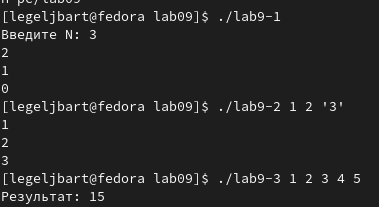
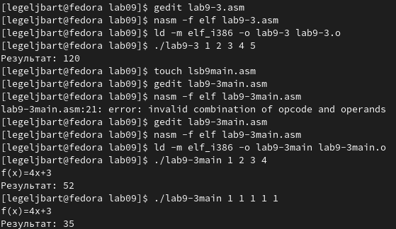

---
## Front matter
title: "Отчёт по лабораторной работе 9"
subtitle: "Программирование цикла"
author: "Лев Евгеньевич Гельбарт"

## Pdf output format
fontsize: 12pt
linestretch: 1.5
papersize: a4
documentclass: scrreprt
## I18n polyglossia
polyglossia-lang:
  name: russian
  options:
	- spelling=modern
	- babelshorthands=true
polyglossia-otherlangs:
  name: english
## I18n babel
babel-lang: russian
babel-otherlangs: english
## Fonts
mainfont: PT Serif
romanfont: PT Serif
sansfont: PT Sans
monofont: PT Mono
mainfontoptions: Ligatures=TeX
romanfontoptions: Ligatures=TeX
sansfontoptions: Ligatures=TeX,Scale=MatchLowercase
monofontoptions: Scale=MatchLowercase,Scale=0.9
## Biblatex
biblatex: true
biblio-style: "gost-numeric"
biblatexoptions:
  - parentracker=true
  - backend=biber
  - hyperref=auto
  - language=auto
  - autolang=other*
  - citestyle=gost-numeric
## Pandoc-crossref LaTeX customization
figureTitle: "Рис."
tableTitle: "Таблица"
listingTitle: "Листинг"
lofTitle: "Список иллюстраций"
lotTitle: "Список таблиц"
lolTitle: "Листинги"
## Misc options
indent: true
header-includes:
  - \usepackage{indentfirst}
  - \usepackage{float} # keep figures where there are in the text
  - \floatplacement{figure}{H} # keep figures where there are in the text
---

# Цель работы

Приобретение навыков написания программ с использованием циклов.

# Выполнение лабораторной работы

Написаны по шаблону программы, результаты работы которых показаны на фото (рис. [-@fig:001]). Ответим на вопросы. В первом коде ecx принимала значения N из ввода, затем N как число (был символ). Число проходов цикла сначала не было правильно (фотки нет, комп перезагружался), затем стало правильным. Теперь вопросы ко второму коду. Был обработан один аргумент, превые два пошли как количество и название.

{ #fig:001 width=70% }

Изменена программа lab9-3 так, чтобы вместо суммирования мы имеем умножение (рис. [-@fig:002]).
Затем пишем программу, выполняющую цикл в моем 5 варианте f(x)=4x+3.

{ #fig:002 width=70% }

# Выводы

Были получены навыки работы с циклами.

