---
## Front matter
title: "Отчёта по лабораторной работе 10"
subtitle: "Отладка"
author: "Лев Евгеньевич Гельбарт"

## Pdf output format
fontsize: 12pt
linestretch: 1.5
papersize: a4
documentclass: scrreprt
## I18n polyglossia
polyglossia-lang:
  name: russian
  options:
	- spelling=modern
	- babelshorthands=true
polyglossia-otherlangs:
  name: english
## I18n babel
babel-lang: russian
babel-otherlangs: english
## Fonts
mainfont: PT Serif
romanfont: PT Serif
sansfont: PT Sans
monofont: PT Mono
mainfontoptions: Ligatures=TeX
romanfontoptions: Ligatures=TeX
sansfontoptions: Ligatures=TeX,Scale=MatchLowercase
monofontoptions: Scale=MatchLowercase,Scale=0.9
## Biblatex
biblatex: true
biblio-style: "gost-numeric"
biblatexoptions:
  - parentracker=true
  - backend=biber
  - hyperref=auto
  - language=auto
  - autolang=other*
  - citestyle=gost-numeric
## Pandoc-crossref LaTeX customization
figureTitle: "Рис."
tableTitle: "Таблица"
listingTitle: "Листинг"
lofTitle: "Список иллюстраций"
lotTitle: "Список таблиц"
lolTitle: "Листинги"
## Misc options
indent: true
header-includes:
  - \usepackage{indentfirst}
  - \usepackage{float} # keep figures where there are in the text
  - \floatplacement{figure}{H} # keep figures where there are in the text
---

# Цель работы

Приобретение навыов написания программ с использованием подпрограмм. Знакомство с методами отладки при помощи GDB и его основными возможностями.

# Выполнение лабораторной работы
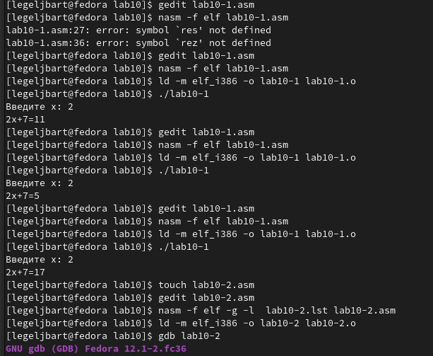{ #fig:001 width=70% }

Напишем программу по шаблону, увидим что она работает. Затем отредактируем код с созданием дополнительной подпрограммы (текст приложен), видим, что она сработала со второго раза (рис. [-@fig:001]).
 
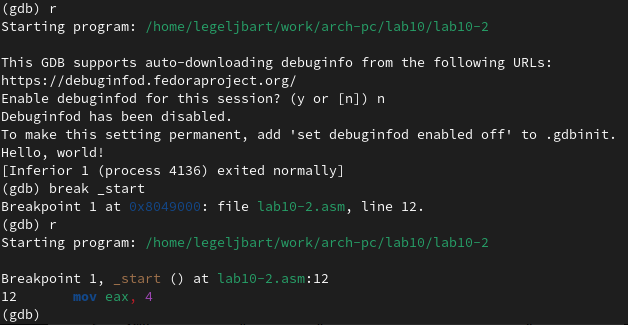{ #fig:002 width=70% }

Запустим gdb, запустим программу, убедимся в работе. Поставим брейкпоинт и запустим после этого. Видим, что теперь программа сразу заканчивается (рис. [-@fig:002]).
 
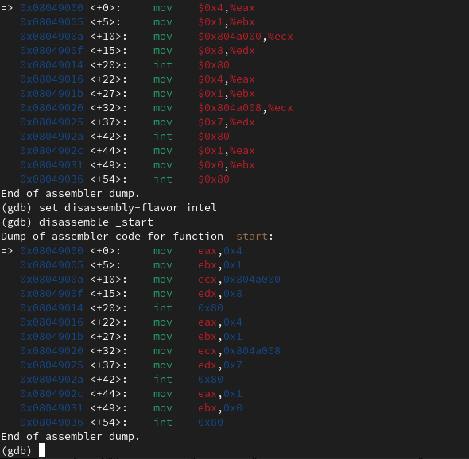{ #fig:003 width=70% }

Просмотрим дисассимилированный код сначала в АТТ синтаксисе, затем в Интеле.(рис. [-@fig:003]).

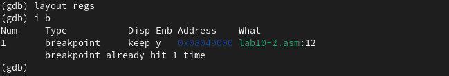{ #fig:004 width=70% }

Запустим layout, изучим брейкпоинты (рис. [-@fig:004]).

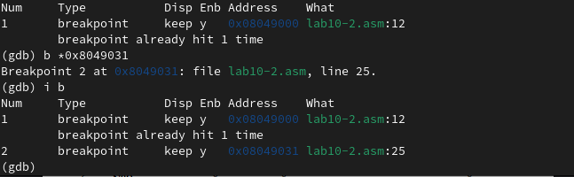{ #fig:005 width=70% }

Поставим брейкпоинт на 0х8049031 (рис. [-@fig:005]).

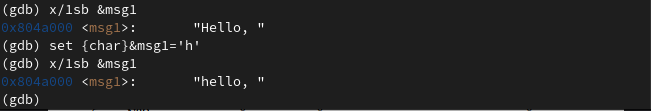{ #fig:006 width=70% }

Поиграем с переменной, заменим H на h в msg1 (рис. [-@fig:006]).

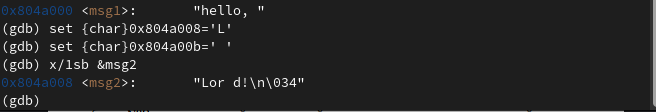{ #fig:007 width=70% }

Так же поработаем и с переменной msg2 (рис. [-@fig:007]).

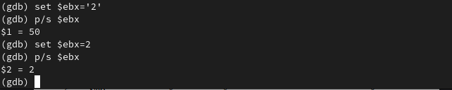{ #fig:008 width=70% }

Изменим и выведем значения регистра ebx, сначала это 2 как строка/символ, затем это уже число (рис. [-@fig:008]).

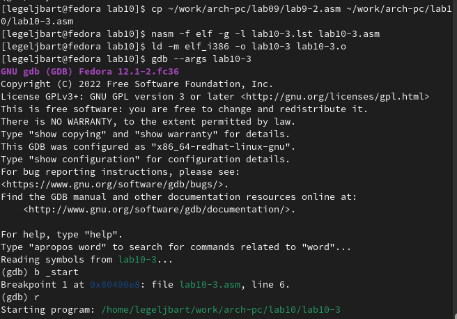{ #fig:009 width=70% }

Скопируем написанный ранее код в 10-3 (рис. [-@fig:009]). 

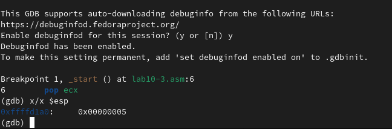{ #fig:010 width=70% }

Загрузим файл в отладчик указав аргументы, как указано и увидим, что аргументов 5 (рис. [-@fig:010]). 

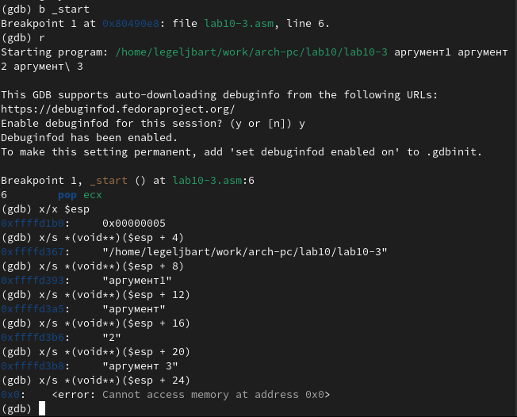{ #fig:011 width=70% }

Посмотрим позиции стека, с шагом 4, так как столько занимает ссылка на адрес следующего элемента, видим что аргументы таковы, какими им и следует быть (рис. [-@fig:011]).

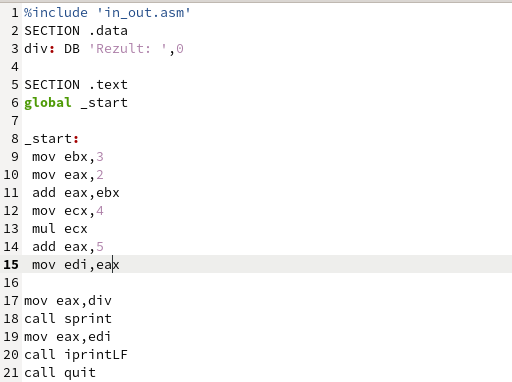{ #fig:012 width=70% }

Представляю Вашему вниманию исправленный и функционирующий код для самостоятельной работы, процесс отладки занимает слишком много скринштов, поэтому я счел допустимым его опустить. Ошибка была в регистре ebx, он использовался вместо eax во многих строках, что привело к неправильному выполнению программы умножения (рис. [-@fig:012]).

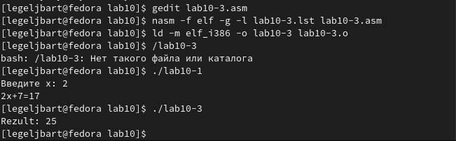{ #fig:013 width=70% }

Видим что программа и правда работает.

# Выводы

Были получены навыки написания программ с использованием подпрограмм и отладки кода.
