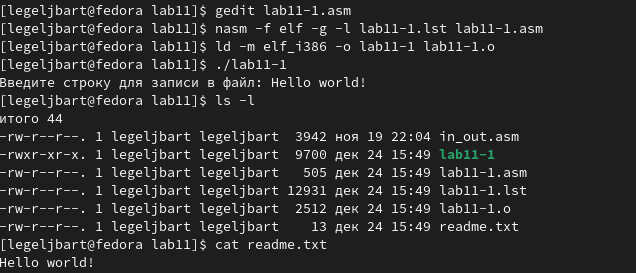
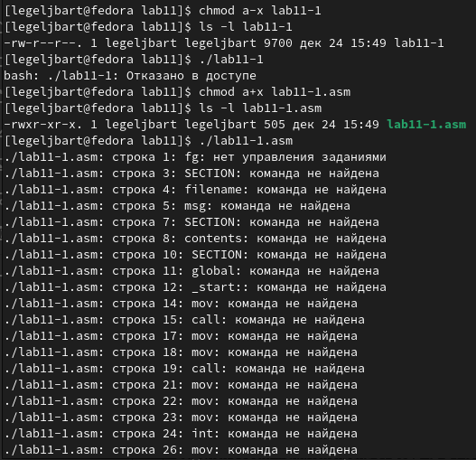
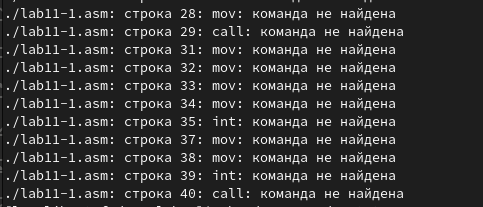
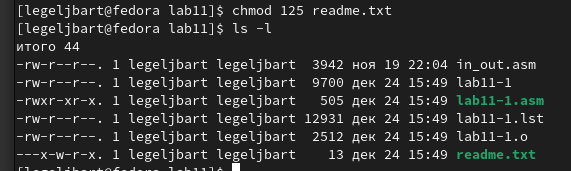
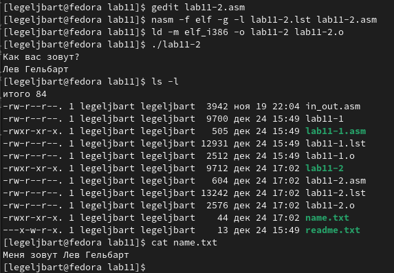

---
## Front matter
title: "Отчёт по лабораторной работе"
subtitle: "Работа с файлами средствами NASM"
author: "Гельбарт Лев Евгеньевич"

## Generic otions
lang: ru-RU
toc-title: "Содержание"

## Pdf output format
fontsize: 12pt
linestretch: 1.5
papersize: a4
documentclass: scrreprt
## I18n polyglossia
polyglossia-lang:
  name: russian
  options:
	- spelling=modern
	- babelshorthands=true
polyglossia-otherlangs:
  name: english
## I18n babel
babel-lang: russian
babel-otherlangs: english
## Fonts
mainfont: PT Serif
romanfont: PT Serif
sansfont: PT Sans
monofont: PT Mono
mainfontoptions: Ligatures=TeX
romanfontoptions: Ligatures=TeX
sansfontoptions: Ligatures=TeX,Scale=MatchLowercase
monofontoptions: Scale=MatchLowercase,Scale=0.9
## Biblatex
biblatex: true
biblio-style: "gost-numeric"
biblatexoptions:
  - parentracker=true
  - backend=biber
  - hyperref=auto
  - language=auto
  - autolang=other*
  - citestyle=gost-numeric
## Pandoc-crossref LaTeX customization
figureTitle: "Рис."
tableTitle: "Таблица"
listingTitle: "Листинг"
lofTitle: "Список иллюстраций"
lotTitle: "Список таблиц"
lolTitle: "Листинги"
## Misc options
indent: true
header-includes:
  - \usepackage{indentfirst}
  - \usepackage{float} # keep figures where there are in the text
  - \floatplacement{figure}{H} # keep figures where there are in the text
---

# Цель работы

Приобретение навыков написания программ для работы с файлами и работы с правами доступа к файлам.

# Выполнение лабораторной работы

{ #fig:001 width=70% }

По шаблону написана программа, записывающие введенную строку в файл, затем выводим содержание этого файла - строку, введенные с клавиатуры, и убеждаемся в функционировании кода (рис. [-@fig:001]).

{ #fig:002 width=70% }

{ #fig:003 width=70% }

Теперь с помощью команды chmod закроем право доступа к файлу, и попробуем открыть - видим, что не получается, т.к. мы запретили доступ к файлу. (рис. [-@fig:002]). Здесь же еще раз изменим право доступа, добавим право на исполнение. Открываем - и видим множество ошибок, так как файл написан для иного исполнение, нежели то, что мы сейчас сделали (рис. [-@fig:003]).

{ #fig:004 width=70% }

Теперь с помощью команды chmod зададим те права, которые соответствуют моему варианту (пятый) --x -w- r-x, для этого использован код 125. Видим, что действительно, права именно те, что и надо (рис. [-@fig:004]).

# Выполнение самостоятельной работы
Представлен программный код, выводящий приглашение с просьбой ввести имя пользователя, считывает его, создает файл name.txt и пишет туда "Меня зовут " и имя пользователя.

%include 'in_out.asm'

SECTION .data
filename db 'name.txt', 0h
msg1 db 'Как вас зовут?', 0h
msg2 db 'Меня зовут ', 0h

SECTION .bss
 contents resb 255
SECTION .text
 global _start
_start:
 mov eax, msg1
 call sprintLF
 
 mov ecx, contents
 mov edx, 255
 call sread
 
 mov ecx, 0777o
 mov ebx, filename
 mov eax, 8
 int 80h
 
 mov esi, eax
 
 mov eax, msg2
 call slen
 
 mov edx, eax
 mov ecx, msg2
 mov ebx, esi
 mov eax, 4
 int 80h
 
 mov eax, contents
 call slen
 
 mov edx, eax
 mov ecx, contents
 mov ebx, esi
 mov eax, 4
 int 80h
 
 mov ebx, esi
 mov eax, 6
 int 80h
 call quit

{ #fig:005 width=70% }

Запустим программу, введем мое имя, теперь убедимся, что файл для сообщения создан, откроем его, и видим там именно тот текст, что и надо (рис. [-@fig:005]).

# Выводы

Были получены навыки написания программ для работы с файлами и работы с правами доступа к ним.
